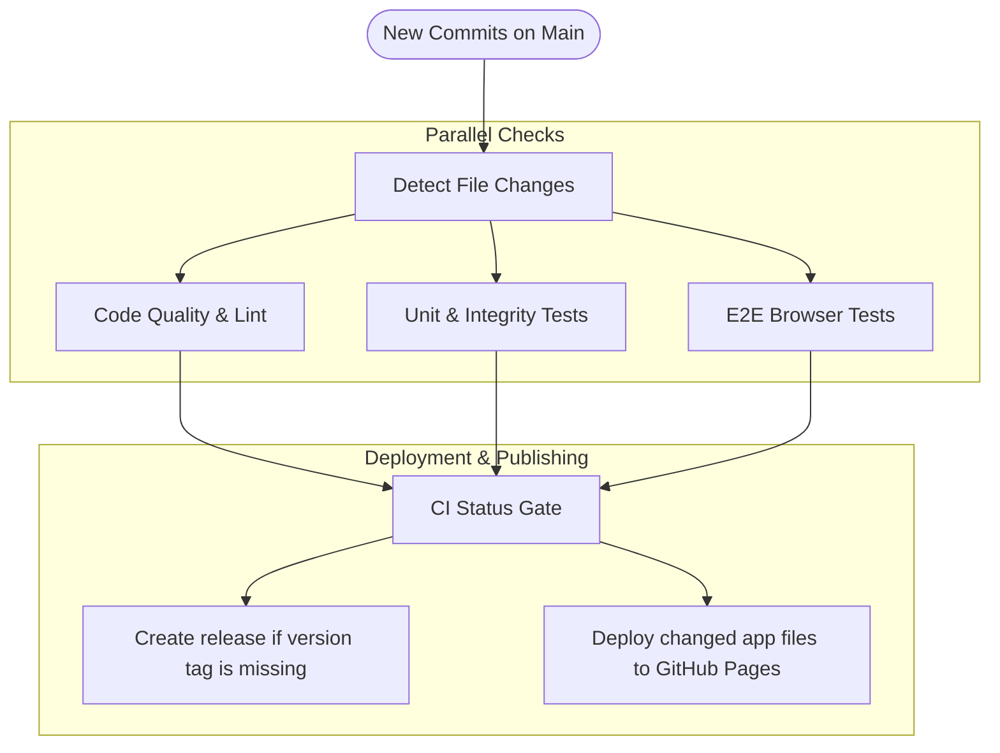

# Contributing to BullSheet

Thanks for your interest in contributing to **BullSheet**!

BullSheet is a lightweight, zero-dependency, client-side darts scoreboard and party game app built with vanilla web technologies.

---

## 📂 Project Architecture

```
bull-sheet/
├── index.html                  # Single-page app markup & views
├── manifest.json               # Progressive Web App manifest
├── sw.js                       # Service Worker & offline caching
├── CHANGELOG.md                # Single source of truth for release notes
├── CONTRIBUTING.md             # Contributor guide & testing docs
├── package.json                # Project & dev dependencies
├── eslint.config.js            # ESLint static analysis configuration
├── playwright.config.js        # Playwright E2E browser test configuration
├── dev_server.js               # Zero-dependency static HTTP dev server
├── audio/                      # Bundled referee voice clips
├── docs/screenshots/           # README screenshots
├── css/
│   ├── main.css                # Layout, components, and responsive styles
│   ├── themes.css              # Theme CSS variables (Pub Chalkboard, Excel, PDC, OLED)
│   └── animations.css          # Subtle UI transitions
├── js/
│   ├── app.js                  # Main controller and route switcher
│   ├── audio/                  # Audio caller and procedural sound effects
│   ├── bot/                    # Tactical AI engine and skill profiles
│   ├── components/             # Dartboard, Keypad, Scoreboard, Match Card
│   ├── games/                  # Modular game engines (10 modes)
│   └── storage/                # LocalStorage management and import/export
└── tests/
    ├── unit/                   # Native Node.js unit tests (0 dependencies)
    └── e2e/                    # Playwright automated browser tests
```

---

## 🚀 Getting Started

Because there is no build step, you can serve the directory with any static HTTP server:

```bash
git clone https://github.com/ziyuonmain/bull-sheet.git
cd bull-sheet

# Start dev server
npm start
```

Then open **[http://localhost:8080/](http://localhost:8080/)** in your browser.

---

## 🧪 Testing & Development Environment

BullSheet uses Node.js built-in **`node:test`** runner for unit tests and **Playwright** for E2E browser testing.

### Run Linter
```bash
npm run lint

# Or run with auto-fix
npm run lint:fix
```

### Run Tests
```bash
# Run only unit tests (zero-config, native Node.js runner)
npm run test:unit

# Install Playwright browser binary (first time only)
npx playwright install chromium

# Run headless browser E2E tests
npm run test:e2e

# Run all tests (unit + E2E)
npm test
```

### Test Suite Organization

```
tests/
├── unit/
│   ├── x01.test.js            # X01 scoring, Double In/Out, Sets & Legs, busts, and undo
│   ├── cricket.test.js        # Standard & Cutthroat Cricket, 3-mark closures, MPR
│   ├── party_games.test.js    # Killer, Elimination, Shanghai, Around the Clock, Bob's 27
│   ├── bot_engine.test.js     # 5 bot difficulty profiles, accuracy scaling, dart simulation
│   ├── checkout.test.js       # Complete 170-to-2 checkout paths & bogey number detection
│   ├── stats_store.test.js    # LocalStorage persistence, lifetime stats, JSON import/export
│   ├── caller.test.js         # Audio caller behavior and announcement synchronization
│   ├── changelog.test.js      # CHANGELOG.md markdown structure & parser verification
│   └── integrity.test.js      # Static assets (audio/icons) & Service Worker cache validation
└── e2e/
    └── e2e.test.js            # Playwright headless browser E2E flow tests
```

When adding new game modes or components, please add corresponding unit tests in `tests/`.

---

## ➕ Adding a New Game Engine

Game engines are modular ES6 classes in `js/games/`. Implement the shared contract:

- `constructor(config)` initializes players and match state.
- `recordDart(dart)` records an action and returns its result.
- `finishTurn()` advances play and clears the current visit.
- `undo()` restores the exact prior state.
- `getActivePlayer()` returns the active player.
- `isMatchOver` and `winner` expose match completion.

Before mutating state in `recordDart()` or `finishTurn()`, save a history snapshot. `undo()` must restore player scores, turns, and match flags. For elimination games, skip eliminated players when choosing and advancing the active player. Keep non-X01 statistics separate from X01 averages and checkout metrics.

Use this shape as a starting point:

```javascript
export class CustomGame {
  constructor(config = {}) {
    this.players = (config.players || [{ name: 'Player 1' }]).map((p, idx) => ({ ... }));
    this.activePlayerIdx = 0;
    this.turnDarts = [];
    this.history = [];
    this.isMatchOver = false;
    this.winner = null;
  }

  getActivePlayer() { return this.players[this.activePlayerIdx]; }
  recordDart(dart) { ... }
  finishTurn() { ... }
  undo() { ... }
}
```

---

## 📦 Versioning & Release Workflow

BullSheet adheres to [Semantic Versioning (SemVer)](https://semver.org/) and [Keep a Changelog](https://keepachangelog.com/).

### Automated Version Bumping
Instead of manually editing version strings across 5 separate files, use the built-in helper:

```bash
# Bump patch version (e.g. 1.4.2 -> 1.4.3)
npm run bump patch

# Bump minor version (e.g. 1.4.2 -> 1.5.0)
npm run bump minor

# Bump major version (e.g. 1.4.2 -> 2.0.0)
npm run bump major
```

**What `npm run bump` does automatically:**
1. Updates `"version"` in `package.json` and `package-lock.json`.
2. Synchronizes the in-app version badge in `index.html`.
3. Updates version integrity checks in `tests/unit/changelog.test.js`.
4. Creates a release skeleton in `CHANGELOG.md` if not already present.
5. Runs `npm run lint` and `npm run test:unit` to guarantee everything is green.

### GitHub Actions Auto-Release & CI Pipeline
When code is pushed or merged into `main`:
- Changed files are automatically detected to run only affected checks in parallel.
- After successful CI on `main`, GitHub Actions creates and pushes an annotated `vX.Y.Z` tag when that version is not tagged yet, then publishes a GitHub Release using `CHANGELOG.md`.
- GitHub Pages deploys after successful CI when app files changed. A repository owner can also start a manual deployment from Actions.



---

## ✅ Development Checklist

When contributing to BullSheet, keep the following core principles in mind:

1. **Zero Runtime Dependencies**:
   - BullSheet has **zero** client runtime dependencies. All logic is pure vanilla ES6 modules and native Web APIs.
   - Do not install npm runtime packages (keep npm dependencies strictly in `devDependencies` for linting/testing).
2. **Service Worker (`sw.js`) Cache Integrity**:
   - When adding a new JS module, audio file, or icon, you **must** register it in `ASSETS_TO_CACHE` in `sw.js`.
   - The test `tests/unit/integrity.test.js` enforces that all cached files exist on disk.
3. **Responsive Mobile Ergonomics**:
   - BullSheet is designed for phones and tablets at the darts oche. Always test changes across both mobile portrait (`< 768px`) and desktop landscape.
   - Avoid fixed widths or elements that cause horizontal scrolling on mobile.
4. **CHANGELOG Integrity**:
   - `CHANGELOG.md` is loaded and rendered dynamically at runtime by the in-app changelog viewer (`js/components/changelog_loader.js`).
   - Group entries under standard Keep-a-Changelog headings: `#### Added`, `#### Changed`, `#### Fixed`, `#### Removed`.

---

## ✍️ Commit & Pull Request Guidelines

- **Conventional Commits**: Format commit messages using standard prefixes:
  - `feat:` New features or game modes
  - `fix:` Bug fixes
  - `style:` Formatting, UI/CSS alignment, visual tweaks
  - `docs:` Documentation and changelog updates
  - `test:` Adding or updating test cases
  - `chore:` Maintenance, git hygiene, tooling
- **Release Notes**: When adding a user-facing change, update [`CHANGELOG.md`](CHANGELOG.md). The in-app changelog viewer automatically renders changes directly from this file!

## 🤖 Agentic Development & Pair Programming

BullSheet includes a complete agentic customization ecosystem with rules, skills, specialized subagents, and automated quality gates. For details on working with AI agents on this codebase, refer to:

- [Agentic Development Workflow Guide](docs/AGENTIC_WORKFLOW.md)
- [Agent Guidelines](AGENTS.md)

---

## 📄 License

By contributing, you agree that your contributions will be licensed under the [GNU General Public License v3.0 (GPL-3.0)](LICENSE).
