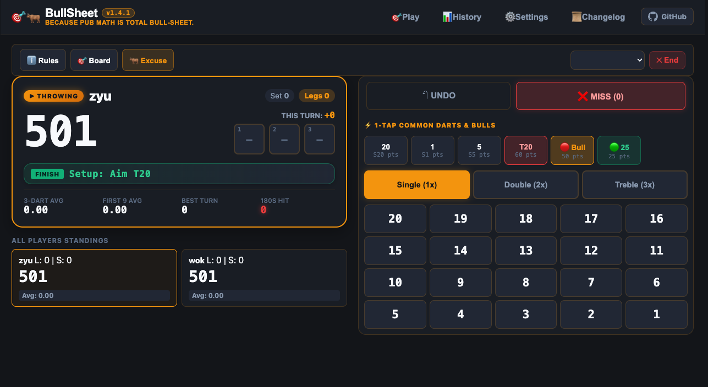
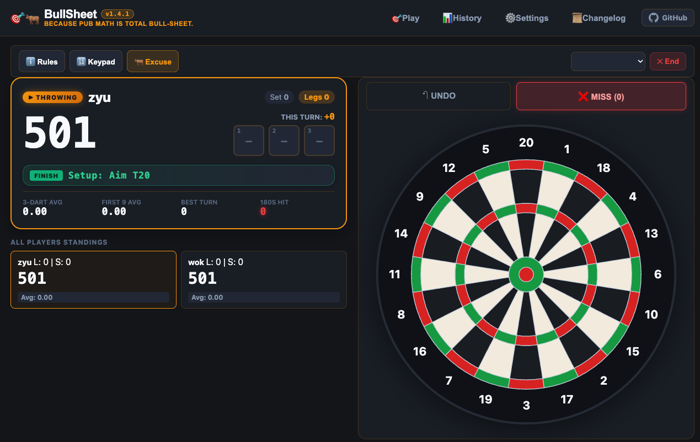
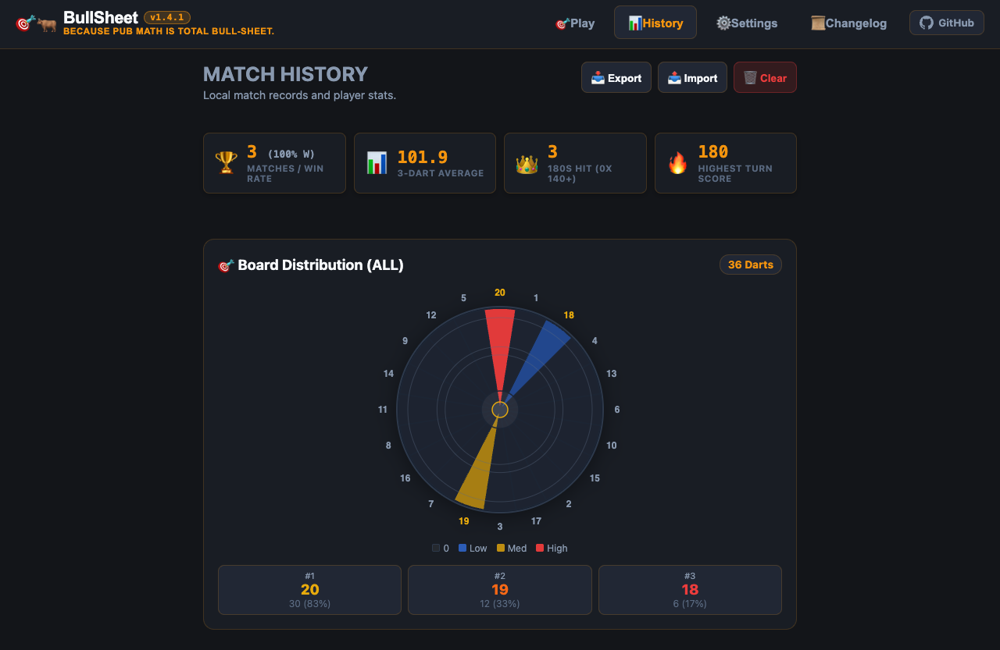
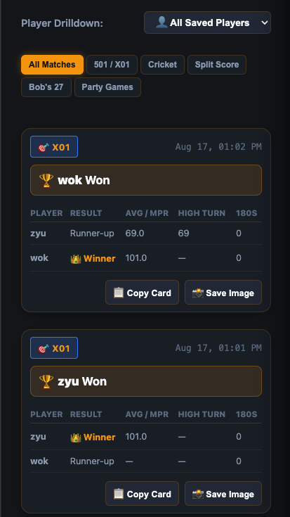
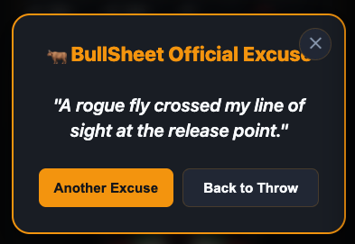
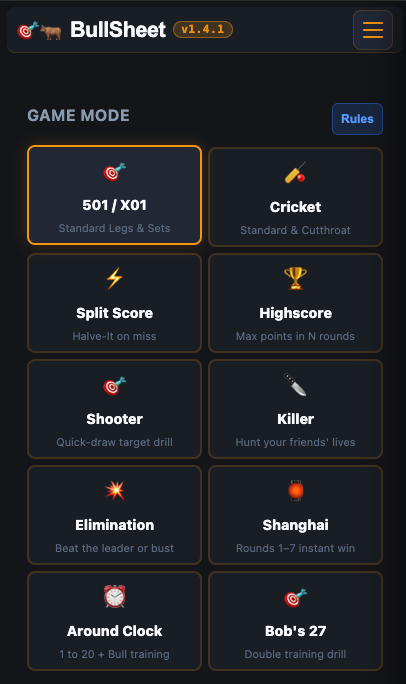
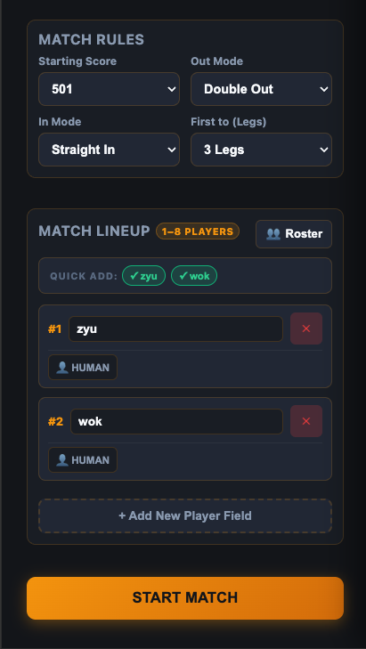
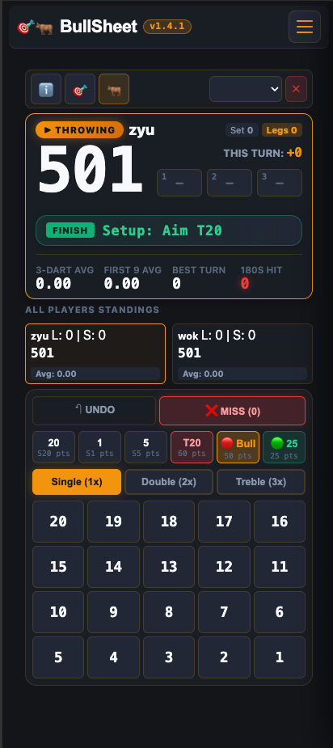
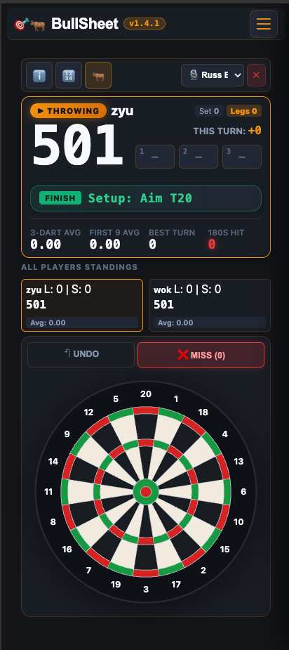

# 🐂🎯 BullSheet

> *Because pub math is total bull-sheet.*

A darts scoreboard web app that runs in your browser. No ads, no accounts, no install required. Works offline once loaded.

<p align="center">
  <strong>🎯 <a href="https://zyu-wok.github.io/bull-sheet/">Play BullSheet</a> 🎯</strong>
</p>

Designed to run on a phone or tablet at the oche. Or honestly, a laptop on the kitchen table.

Vibe-coded in an evening, because every other darts app insists on showing you endless 30-second ads with an "x" button harder to find than Waldo — all before you can subtract 60 (or in my case, 26) from 501. */rant*

---

## 📸 Screenshots

> For more examples, check out `assets/screenshots/`, or just start playing!

| Keypad Buttons | Interactive Dartsboard |
| :---: | :---: |
|  |  |

| Radial Heatmap | Match History |
| :---: | :---: |
|  |  |

---

## What It Does

### 10 Game Modes

| Mode | What It Is |
| :--- | :--- |
| **X01** | 101 / 301 / 501 (default) / 701 with configurable In/Out rules (Straight In, Double Out, etc.), Legs & Sets |
| **Cricket** | Standard and Cutthroat, with marks-per-round tracking |
| **Split Score** | Halve-It — miss your target, lose half your score |
| **Killer** | Party game: claim a double, gain killer status, hunt opponents' lives |
| **Elimination** | Beat the previous player's 3-dart total or lose a life |
| **Shanghai** | Sequential rounds, instant win if you hit single + double + treble in one turn |
| **Around the Clock** | Race from 1 → 20 → Bull, with double/treble jumps |
| **Bob's 27** | The classic doubles training drill (start at 27, hit your doubles or lose points) |
| **Highscore** | Fixed-round scoring practice (5, 7, or 10 rounds) |
| **Shooter** | Random target accuracy drill |

### Two Input Methods
- **Pro Speed Keypad** — Quick-tap buttons for common scores (20, 1, 5, T20, Bull, 25, Miss) with multiplier toggles (Double, Treble). Fast enough for real match play.
- **Interactive SVG Dartboard** — Tap directly on the board. Highlights checkout routes during X01 finishes.

Toggle between them mid-game with the 🎯 button.

### Caller Voice Packs
Three pre-recorded audio caller packs with score announcements:
- **🎙️ Russ Bray** ("The Voice")
- **🎯 George Noble**
- **🎩 British Referee**

Volume control and mute toggle in settings.

### AI Opponents
Five bot difficulty profiles for solo practice:

| Bot | Skill | Vibe |
| :--- | :--- | :--- |
| 🤡 Beginner | Shaky aim, lots of misses | Your mate who's "never played before" |
| 🍺 Casual | Solid singles, occasional trebles | Pub league regular |
| 📊 Tactician | Calculated, low miss rate | Plays the percentages |
| 🎯 Semi-Pro | Heavy treble scoring | County-level |
| 👑 Master | Near-flawless | Not fun to play against |

### Other Stuff

- **Save your mates** — Add regulars, tap to add them to the lineup
- **Match history** — Local match log with 3-dart averages, 180 counts, and high turns
- **Throw heatmap** — Radial visualization of where your darts actually landed
- **Match card export** — Generates a shareable PNG summary of the match
- **History import/export** — Backup and restore match data as JSON
- **Rules reference** — Built-in rules popup for each game mode
- **Checkout suggestions** — PDC checkout route lookup for X01 finishes
- **Multi-step undo** — Works across all game modes
- **4 color themes** — Pub Chalkboard (default), Excel Sheet, PDC Arena (neon), OLED Midnight
- **Pub excuse generator** — Miss the board? No worries, I got you covered.

  

### 📱 Mobile at the Oche (PWA)
- Installable as a Progressive Web App (Add to Home Screen on iOS / Android)
- High-contrast, large touch targets designed for phone mounts and kitchen tablets
- Everything stored locally in `localStorage` — 100% offline-first, no accounts or telemetry

<p align="center">
  
  &nbsp;&nbsp;
  
  &nbsp;&nbsp;
  
  &nbsp;&nbsp;
  
</p>

---

## ⚡ Tech Stack

Built with pure web standards — zero frameworks, zero runtime dependencies, zero build steps:

- **Logic**: Vanilla ES6+ JavaScript (Modular classes)
- **UI & Themes**: Semantic HTML5 & CSS3 variables (Dark-mode & oche-contrast)
- **Dartboard**: Pure SVG with coordinate-based ring and segment hit detection
- **Audio Engine**: Web Audio API with pre-recorded MP3 caller voice packs
- **Storage & PWA**: Service Worker cache & `localStorage` (100% offline-first)

---

## 🛠️ Development & Contributing

BullSheet is built with vanilla ES6+ JavaScript, HTML5, and CSS3 — zero runtime frameworks, zero runtime dependencies.

```bash
# Start local dev server (http://localhost:8080)
npm start

# Run full test suite (Node.js unit tests + Playwright E2E)
npm test
```

For project architecture, test suite organization, and contributor guidelines, see [**CONTRIBUTING.md**](CONTRIBUTING.md).

---

## 📜 License

[GPL-3.0](LICENSE)
