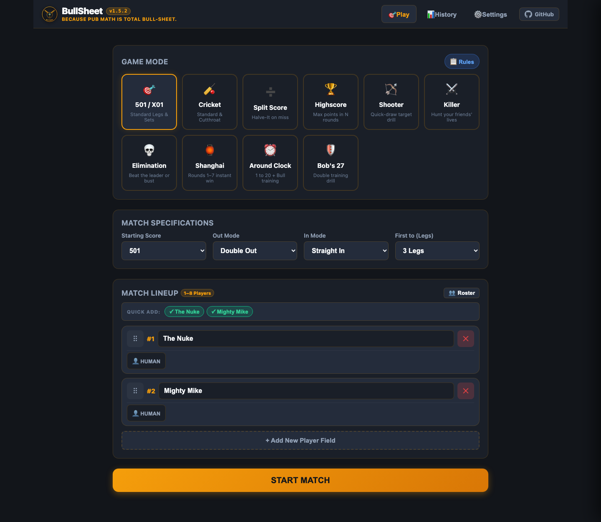
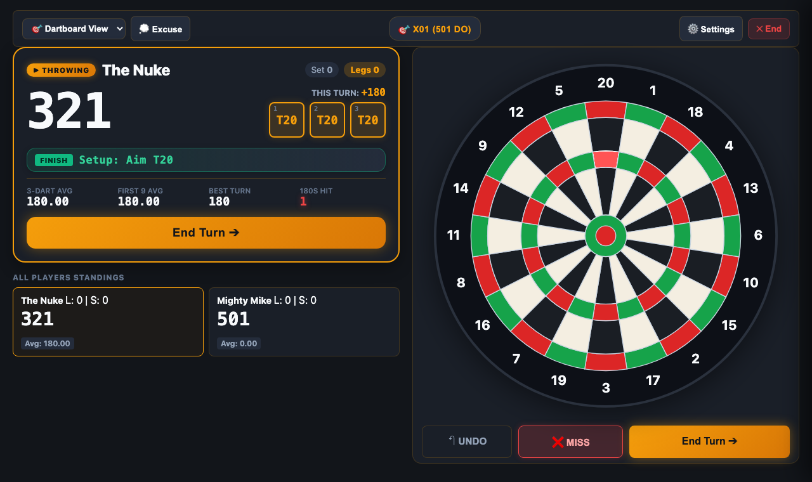
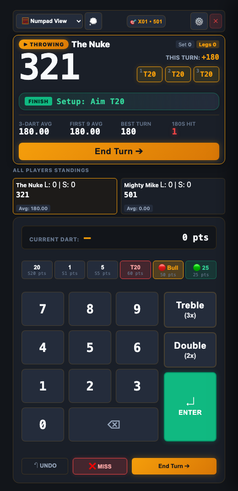
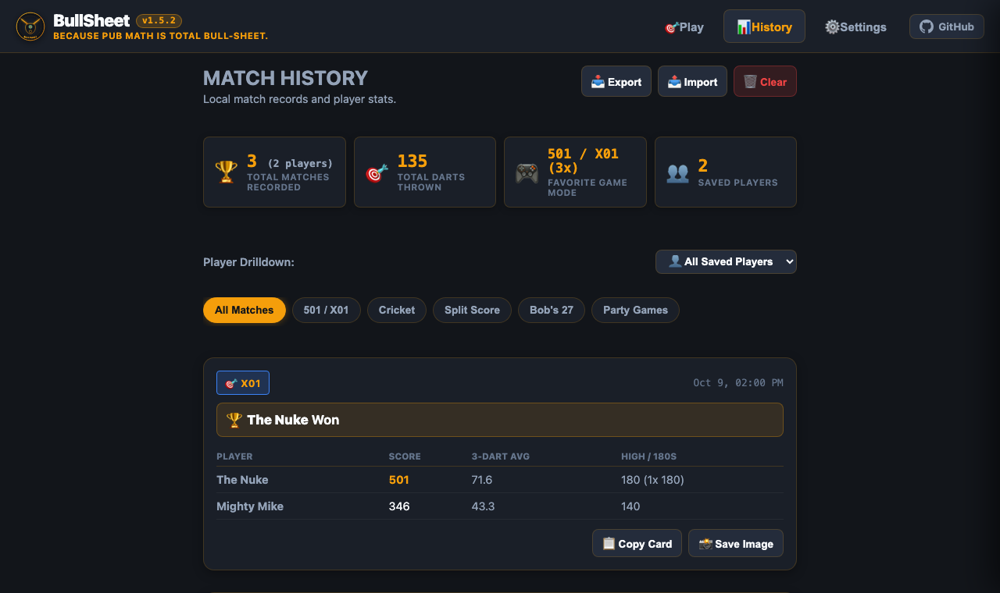
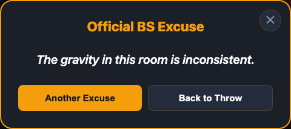

# BullSheet

> *Because pub math is total bull-sheet.*

A darts scoreboard for matches and practice on phones, tablets, and desktops. No ads, no account required and no telemetry collected.

<p align="center"><a href="https://ziyuonmain.github.io/bull-sheet/"><strong>🎯 Play BullSheet 🎯</strong></a></p>

## Highlights

- **Choose how to score:** switch between the interactive dartboard, speed keypad, and numpad.
- **Play solo or with friends:** ten game modes, training drills, and five bot skill levels.
- **Keep your match records:** review stats and high turns, undo darts, import or export history, and share a match card.
- **Make it yours:** four themes and an installable PWA. Match data stays local, and play works offline after the first load.
- **Extras:** X01 checkout suggestions, announcer voice packs, and a pub excuse generator for missed darts.

## Screenshots

**Landing page**

  [](assets/screenshots/landscape/setup.png)

**Match play**

| Landscape - dartboard | Portrait - numpad |
| :---: | :---: |
| [](assets/screenshots/landscape/x01_dartsboard.png) | [](assets/screenshots/portrait/x01_numpad.png) |

**Match history**

[](assets/screenshots/landscape/history.png)

**And if you miss the dart:**

<p align="center"><a href="assets/screenshots/excuse.png"></a></p>

> :camera: More screenshots available in the [assets/screenshots](assets/screenshots) folder.

## Get started

Add players, choose a game, and start a match. Use the input selector during play to change how you enter darts.

The app has no runtime dependencies or build step.

## Development

```bash
npm start       # local server at http://localhost:8080
npm test        # unit and browser tests
npm run lint    # ESLint
```

See [CONTRIBUTING.md](CONTRIBUTING.md) for project structure and contributor guidance.

## License

[GPL-3.0](LICENSE)
