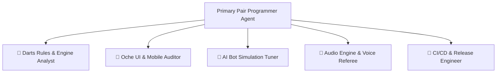
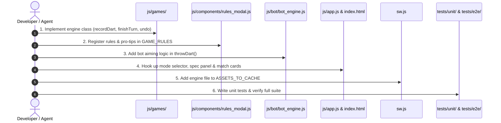
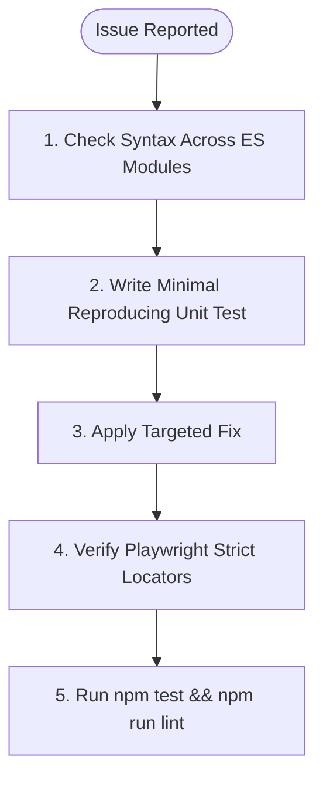
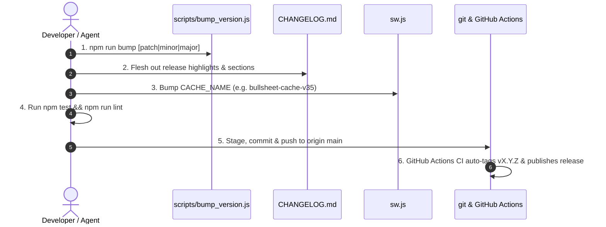

# BullSheet Agentic Development Workflow

This document defines the architectural guidelines, specialist agent ecosystem, standard operating procedures, and automated quality gates for building, testing, and releasing BullSheet with AI agent assistance.

---

## 1. Core Architectural Pillars

BullSheet operates under 4 strict architectural principles:

```
┌────────────────────────────────────────────────────────────────────────┐
│ 1. Zero Runtime Dependencies (Pure Vanilla ES6 Modules & Web APIs)     │
│ 2. Offline-First PWA (Synchronized Service Worker Cache)               │
│ 3. Oche Ergonomics (44px Touch Targets, No Horizontal Scroll, 4 Themes)│
│ 4. Modular Engine Contract (Full Undo Symmetry & Elimination Skipping) │
└────────────────────────────────────────────────────────────────────────┘
```

1. **Zero Runtime Dependencies**: Never add packages to `dependencies` in `package.json`. All application logic must remain pure ES6 modules executed directly by modern browsers without a build or bundler step.
2. **Offline-First PWA**: The application is fully cached by `sw.js`. Any asset added, deleted, or modified must be updated in `ASSETS_TO_CACHE` and validated with `tests/unit/integrity.test.js`.
3. **Oche Mobile Ergonomics**: Interactive targets must be at least **44x44px** for fast touch entry at the darts throw line. All layouts must support all 4 themes (`bullsheet`, `excel`, `pdc_neon`, `oled_midnight`).
4. **Modular Engine Contract**: All game engines in `js/games/` adhere to a standard contract (`recordDart`, `finishTurn`, `undo`, `getActivePlayer`, `isMatchOver`, `winner`) and maintain reversible state snapshots.

---

## 2. Specialist Agent Ecosystem

BullSheet uses specialized agent personas for targeted codebase operations:



### Specialist Profiles

| Specialist Agent | Core Focus Area | Primary Target Files | Diagnostic Commands |
| :--- | :--- | :--- | :--- |
| 🎯 **Darts Rules & Engine Analyst** | PDC/WDF scoring rules, checkout routes, party game mechanics, undo stack symmetry | `js/games/*.js`<br>`tests/unit/*.test.js` | `node --test tests/unit/x01.test.js`<br>`node --test tests/unit/party_games.test.js` |
| 📱 **Oche UI & Mobile Auditor** | 44px touch targets, mobile viewport boundaries, 4-theme CSS variables, triple input modes | `css/*.css`<br>`js/components/*.js`<br>`tests/e2e/e2e.test.js` | `npm run test:e2e`<br>`npm run lint` |
| 🤖 **AI Bot Simulation Tuner** | 5 bot difficulty profiles, coordinate scatter physics, board neighbor drift, tactical targeting | `js/bot/bot_engine.js`<br>`tests/unit/bot_engine.test.js` | `node --test tests/unit/bot_engine.test.js` |
| 📢 **Audio Engine & Voice Referee** | Web Audio SFX, speech synthesis caller cadence, audio mode UI synchronization | `js/audio/*.js`<br>`js/app.js` | `npm run test:e2e`<br>`npm run lint` |
| 🚀 **CI/CD & Release Engineer** | SemVer versioning, Keep-a-Changelog parsing, Service Worker caching, GitHub Actions workflows | `.github/workflows/ci.yml`<br>`sw.js`<br>`CHANGELOG.md` | `npm run test:unit`<br>`npm test` |

---

## 3. Standard Agentic Workflows

### Workflow A: Adding a New Game Mode or Training Drill



#### Step-by-Step Implementation:
1. **Engine Implementation**: Create `js/games/<mode_name>.js` implementing the standard engine contract.
   - For party games with player eliminations (*Killer*, *Elimination*), implement automatic skipping in `finishTurn()`:
     ```javascript
     let nextIdx = (this.activePlayerIdx + 1) % this.players.length;
     while (this.players[nextIdx].isEliminated && attempts < this.players.length) {
       nextIdx = (nextIdx + 1) % this.players.length;
     }
     this.activePlayerIdx = nextIdx;
     ```
2. **Rules & Match Specifications**:
   - Register the rules, objective, and pro-tip in `js/components/rules_modal.js`.
   - In `js/app.js` `updateGameModeSetupUI()`, show `#setup-spec-panel` only if the mode has customizable settings (e.g. Starting Score, Sets/Legs, Lives).
3. **AI Bot Targeting**: In `js/bot/bot_engine.js`, add a dedicated aiming routine scaled to the 5 bot profiles (`bullshitter`, `pub_regular`, `accountant`, `oche_master`, `machine180`).
4. **UI Controller & Stats**: Wire up game mode selection in `index.html` and `js/app.js`, and add history card stat extractors in `js/components/match_card.js`.
5. **Service Worker**: Register `./js/games/<mode_name>.js` in `ASSETS_TO_CACHE` inside `sw.js`.
6. **Testing**: Add unit tests in `tests/unit/<mode_name>.test.js` validating initialization, scoring, undo symmetry, and elimination skipping.

---

### Workflow B: Debugging & Issue Resolution



1. **Syntax Checking**: Run `node --check js/app.js js/components/*.js js/games/*.js js/audio/*.js js/storage/*.js js/bot/*.js` to immediately catch parsing errors, duplicate variables, or unclosed blocks.
2. **Unit Isolation**: Create or run a focused unit test in `tests/unit/` to reproduce the issue in isolation.
3. **Targeted Repair**: Apply the minimal necessary change to fix the root cause.
4. **Strict Locator Scoping**: In Playwright E2E tests, ensure selectors are scoped to parent containers (e.g. `#dart-keypad-container`, `#dart-numpad-container`, `#setup-spec-panel`) to prevent multi-match collisions.
5. **Full Verification**: Run `npm test && npm run lint` to guarantee no regressions.

---

### Workflow C: Automated SemVer Release



1. **Version Bump**: Run `npm run bump [patch|minor|major]` to synchronize version strings across `package.json`, `package-lock.json`, `index.html`, and `tests/unit/changelog.test.js`.
2. **Changelog**: Add release notes to `CHANGELOG.md` under `### 🎯 Release Highlights`, `#### Added`, `#### Changed`, `#### Fixed`, and `#### Removed`.
3. **Cache Invalidation**: Increment `CACHE_NAME` in `sw.js` (e.g. `'bullsheet-cache-v35'`).
4. **Verification**: Run `npm test && npm run lint`.
5. **Commit & Push**:
   ```bash
   git add package.json package-lock.json index.html CHANGELOG.md sw.js tests/unit/changelog.test.js
   git commit -m "chore(release): bump version to 1.X.Y"
   git push origin main
   ```
   > ⚠️ **Do Not Create Local Git Tags**: GitHub Actions CI automatically compares versions, creates the tag `vX.Y.Z`, generates the GitHub Release, and deploys to GitHub Pages.

---

## 4. Merge Conflict & Rebase Hygiene

When rebasing or resolving merge conflicts:
- **Inspect Surrounding Context**: Check that conflicting chunks do not inadvertently restore removed or deprecated UI elements (e.g. redundant navigation buttons).
- **Verify Header Navigation**: The desktop navigation bar strictly contains 3 primary tabs:
  1. `🎯 Play` (`data-target="view-setup"`)
  2. `📊 History` (`data-target="view-stats"`)
  3. `⚙️ Settings` (`data-target="view-settings"`)
- **Run Full E2E Test Suite**: Always execute `npm run test:e2e` after resolving conflicts to verify that the live browser DOM matches expectations.

---

## 5. Automated Quality Gates

Before concluding any task or pushing to `main`, all 4 quality gates must pass:

```bash
# Gate 1: Code Quality & ESLint Linter
npm run lint

# Gate 2: Unit & Asset/Service Worker Integrity Tests
npm run test:unit

# Gate 3: Headless Playwright Browser E2E Tests
npm run test:e2e

# Gate 4: Combined Full Test Suite
npm test
```

| Quality Gate | Tool / Runner | Success Criteria |
| :--- | :--- | :--- |
| **Linting** | ESLint (`eslint .`) | 0 errors, 0 warnings |
| **Unit Tests** | Node.js Test Runner (`node --test`) | 100% pass across all 8 suites |
| **Cache Integrity** | `integrity.test.js` | All cached assets exist on disk |
| **Changelog Integrity** | `changelog.test.js` | `CHANGELOG.md` parses to valid HTML matching current version |
| **E2E Browser Tests** | Playwright (`playwright test`) | 100% pass across mobile & desktop viewports |
